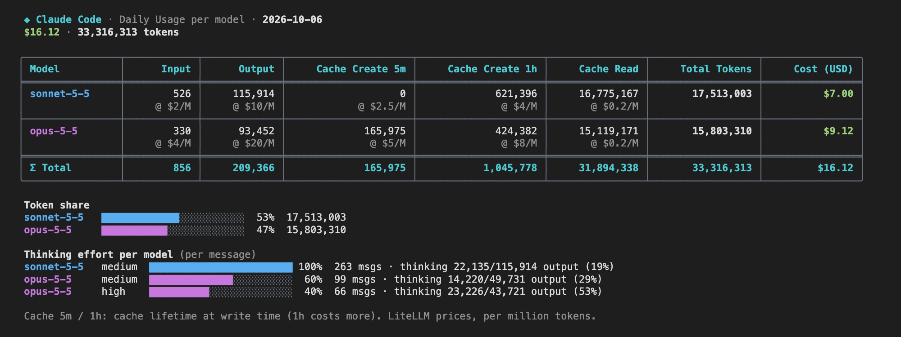

# ccday

Consommation Claude Code **du jour, par modèle**. Version minimaliste inspirée de [ccusage](https://github.com/ccusage/ccusage).



## Installation

Prérequis : [Node.js](https://nodejs.org) 18 ou plus. Aucune dépendance à installer.

### Sans installer (npx)

```bash
npx github:geoffroyriou-weqeep/ccday
npx github:geoffroyriou-weqeep/ccday --date 2026-10-04 --json
```

### En local

```bash
git clone https://github.com/geoffroyriou-weqeep/ccday.git
cd ccday
node ccday.mjs
```

Pour l'avoir en commande `ccday` partout, au choix :

```bash
# lien dans le PATH (le dossier ~/.local/bin doit être dans ton PATH)
mkdir -p ~/.local/bin && ln -s "$PWD/ccday.mjs" ~/.local/bin/ccday

# ou un alias (zsh)
echo "alias ccday='node $PWD/ccday.mjs'" >> ~/.zshrc && source ~/.zshrc
```

Mise à jour : `git pull` dans le dossier cloné.

## Utilisation

```
ccday [--date YYYY-MM-DD] [--json] [--no-cost]
```

(ou `node ccday.mjs …` / `npx github:geoffroyriou-weqeep/ccday …`)

Lit `~/.claude/projects/**/*.jsonl`, affiche Input / Output / Cache Create / Cache Read / Total / Cost par modèle. Aucune dépendance (Node 18+).
